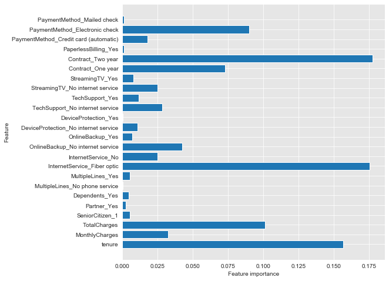
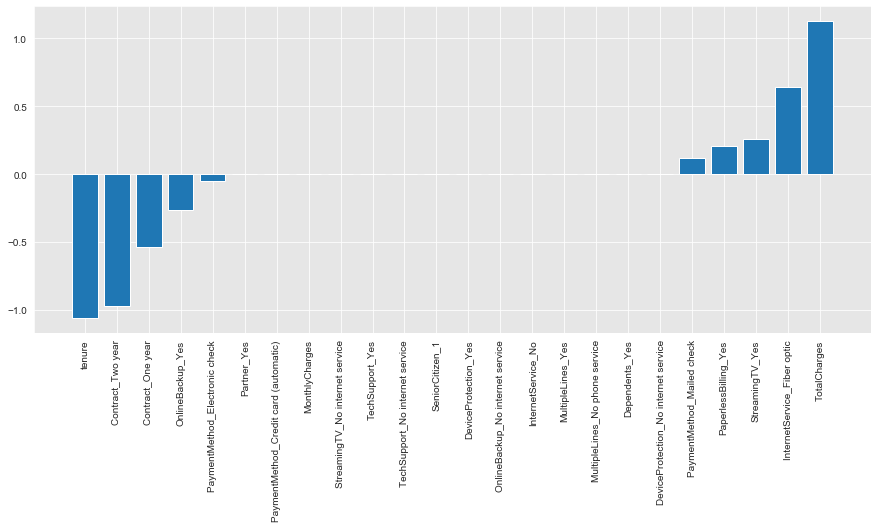
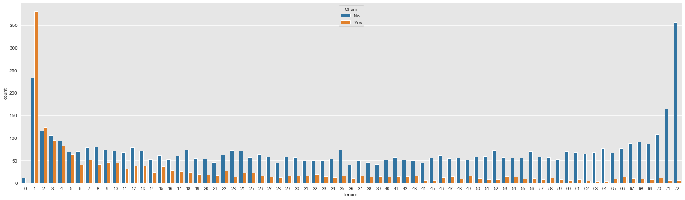
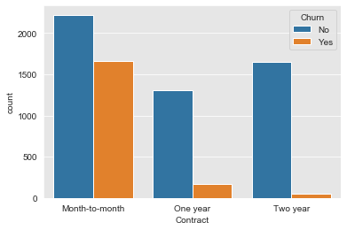

# Module 3 Final Project

## Customer churn in the telecomunication industry

In this project machine learning models are constructed to predict possible customer churn in the telecomunication industry. Predicting churn gives a company the advantage of taking action before losing customers.

## Questions: 

Three business questions are asked and answered in this project.

1. What are the most important factors affecting the customer churn?

2. How can telecomunication companies handle the problem of customer churn with predictive modelling?

3. What is needed to be done to retain churning customers?

## The data:

[Customer Churn Data](https://www.kaggle.com/becksddf/churn-in-telecoms-dataset)

For this project, Kaggle's Telco Customer Churn data is used. The dataset can be found in the given Kaggle link above and in the file "TelcoCustomerChurnData.csv", in this repo. 

## The Process

OSEMN approach is used in this project. It means the data is optained, scrubbed and cleaned, explored and visualized, modelled and interpreted. 

Data science process is iterative, which means a lot of back-and-forth testing new ideas, new features to include, tweaking various hyper-parameters, and so on.

##  Answers to the Questions

1. What are the most important factors affecting the customer churn?
According to the results of many models and EDA, I noted that;

One year or two year contract, Tenure and Tech support decrease churn rate.

Month to month contract, high monthly charges, bad fiber optic internet service increase churn rate.

   The feature importances of the random forest model

   The coefficients of the SCDClassifier Model
            

2. How can telecomunication companies handle the problem of customer churn with predictive modelling?

Machine learning models derived from the given data predict customer churn with 80% accuracy.

Find the customers at high risk to churn.

Direct retention efforts toward such customers.

3. What is necessary to retain churning customers?

Invest on internet quality and coverage. Check the coverage and internet speed of of high risk customers.

Make offers to tenure customers to increase loyalty and keep them engaged.

   Churn countplot of the tenure of the customers

Make offers to month to month customers and make yearly contract.

   Churn countplot of the contract of the customers

## Conclusion

Churn prediction is made with the information of customers. Yearly contract and internet speed, tenure and total charges are important in the model. The goal is to retain customers before they leave.
